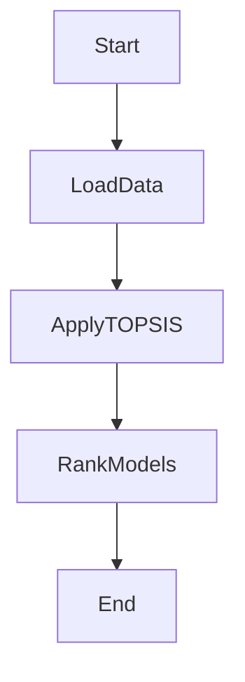

# Topsis_PreTrainedModel

# Text Conversational Model Comparison Assignment (UCS654)

## Overview

Text conversational models are NLP-powered systems designed to engage in natural language conversations with users. These models excel in understanding user intent, maintaining context, and providing contextually relevant responses. Their importance lies in automating customer support, enhancing user engagement, and offering scalable and efficient interactions. They operate 24/7, contributing to cost-effectiveness and improved human-machine interaction. Conversational models streamline processes, making technology more accessible and user-friendly across various industries.

## Key Features:

1. **Metrics Considered:**
   - The comparison is based on essential metrics like perplexity and training time. Perplexity is a measure commonly used to evaluate the performance of language models, particularly in the context of natural language processing (NLP) tasks. It quantifies how well a probabilistic model predicts a sample or sequence of words.

2. **Methodology - TOPSIS:**
   - The Technique for Order of Preference by Similarity to Ideal Solution (TOPSIS) method is employed for the comparison. This method considers both the similarity to the ideal solution and the dissimilarity to the negative ideal solution, providing a comprehensive ranking.

3. **Models Evaluated:**
   - Real-world pretrained models, such as 'DistilBERT', 'T5', 'RoBERTa', 'GPT-3', 'UniLM' are included in the comparison. These models are widely used in text conversation tasks.

## Project Structure:

- **`data.csv`**: CSV file containing evaluation metrics for each model.
- **`result.csv`**: CSV file with ranked results in tabular format.

## Results
| **Model**  | **Topsis Score**  | **Rank** |
|------------|-------------------|----------|
| DistilBERT | 0.8513            | 1.0      |
| T5         | 0.2987            | 4.0      |
| RoBERTa    | 0.6112            | 2.0      |
| GPT-3      | 0.6072            | 3.0      |
| UniLM      | 0.0               | 5.0      |
